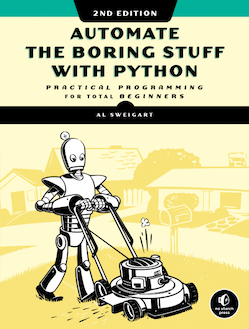

# Automate The Boring Stuff 

The repo contains code references ("solution") for projects used throughout the book, **Automate the Boring Stuff**, by Al Sweigart. It is created as part of an online learning group I mentor.

Please consider making a purchase of Al's excellent book. 



## Requirements
**Python 3.6 and above.**
The code solutions are presented as reference. I recommend that you attempt these challenges yourself, before referring to the code solutions in this repo. 

Some code solutions presented uses intermediate level concepts or newer features of Python not presented in the book (since they're introduced only in Python 3.6 or above). By taking advantage of newer features such as Python's f-strings, list comprehensions, context managers many code solutions are cleaner, shorter and remarkably faster than the given answers in the book. 

Where `sys.argv` code is used in the solutions, I've also replaced them with the `argparse` equivalent (new in Python 3.2), the newer, preferred way of working with command-line options. In addition to being more pythonic, it also has built-in implementations such as `add_mutually_exclusive_group()` to make our code more robust without manually catchig exceptions.

If you have completed the book's exercise, I encourage you to compare your solutions to the presented answer.

### Comparison: Generating Random Quiz Files
A simple comparison to the code in the book vs the one in the repo may serve to illustrate the few differences. The **book's** solutions for **Generating Random Quiz Files** in Chapter 8:
```py
for quizNum in range(35):
# Create the quiz and answer key files.
    quizFile = open('capitalsquiz%s.txt' % (quizNum + 1), 'w')
    answerKeyFile = open('capitalsquiz_answers%s.txt' % (quizNum + 1), 'w')
    quizFile.write('Name:\n\nDate:\n\nPeriod:\n\n')
    quizFile.write((' ' * 20) + 'State Capitals Quiz (Form %s)' % (quizNum + 1)) quizFile.write('\n\n')
    states = list(capitals.keys())
    random.shuffle(states)
    for questionNum in range(50):
        correctAnswer = capitals[states[questionNum]]
        wrongAnswers = list(capitals.values())
        del wrongAnswers[wrongAnswers.index(correctAnswer)]
        wrongAnswers = random.sample(wrongAnswers, 3)
        answerOptions = wrongAnswers + [correctAnswer]
        random.shuffle(answerOptions)
        
        quizFile.write('%s. What is the capital of %s?\n' % (questionNum + 1,
            states[questionNum]))
        for i in range(4):
            quizFile.write(' %s. %s\n' % ('ABCD'[i], answerOptions[i])) 
            quizFile.write('\n')
        # Write the answer key to a file.
        answerKeyFile.write('%s. %s\n' % (questionNum + 1, 'ABCD'[
        answerOptions.index(correctAnswer)])) quizFile.close()
        answerKeyFile.close()
```

The repo's reference solution in `demo_mcq.py`:
```py
for quizNum in range(35):
    with open(f"quiz_{quizNum+1}.txt", 'w') as quizFile, \
        open(f"answer_{quizNum+1}.txt",'w') as answerFile:
        quizFile.write('Name:\n\nDate:\n\nPeriod:\n\n')
        quizFile.write((' ') + f'State Capitals Quiz {quizNum + 1}\n\n')  
        states = list(capitals.keys())
        random.shuffle(states)
        for questionNum in range(50):
            correctAns = capitals[states[questionNum]]
            wrongAns = [i for i in list(capitals.values()) if i != correctAns][:3]
            answerOptions = wrongAns + [correctAns]
            random.shuffle(answerOptions)

            quizFile.write(f'{questionNum + 1}. What is the capital of {states[questionNum]}?\n')
            for i in range(4):
                quizFile.write(f'    {"ABCD"[i]}. {answerOptions[i]}. \n')      
            answerFile.write(f'{questionNum + 1}. {"ABCD"[answerOptions.index(correctAns)]}\n')
```

If you want to join the free, self-moderated study group, follow me on [Facebook](https://www.facebook.com/onlyphantom) and look for my announcements. We work through python book examples and tutorials and compare notes. 

## Support the Author
If you cannot afford purchasing a copy of Al's book, the full content is accessible at [the website](https://automatetheboringstuff.com). Consider a simple donation to the author. 

Piracy hurts the education industry.